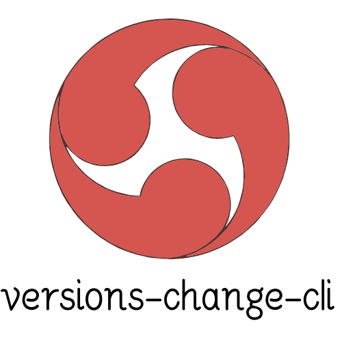

<p align="center">
    
</p>

<h1 align="center">zone-ui</h1>

<p align="center">🌈 一个基于Monorepo模式的前端基建——跨项目组件库.</p>
<p align="center">通过zone-ui，您可以快速搭建属于您自己的组件库.</p>

<p align="center">
  en <a href="./README.zh-CN.md">English</a>
</p>

---

## 特性

- 🚀 跨项目使用的组件库
- 🚀 跨团队共建发展 - 支持多种技术栈
- 🚀 多个项目共用一个文档系统 - All in One 


# 多项目统一管理

我们采用了 Turborepo 来进行项目管理，Turborepo 是一个高性能的 JavaScript 和 TypeScript 项目构建系统，采用 Go 语言实现，所以在语言层面上就具有一定的性能优势，可以大大提高 monorepo 项目的构建速度。
您可以在 [Turborepo 官网](https://turbo.build/repo)中获取更多信息。
我们已经将会用到命令写在了 npm script 中，您可以通过执行下列命令来进行对应的操作。

```
#启动仓库内的所有项目
npm run dev

#启动仓库内所有项目的自动化测试和单元测试
npm run tset

#启动仓库内所有项目的打包命令
npm run dev

```
